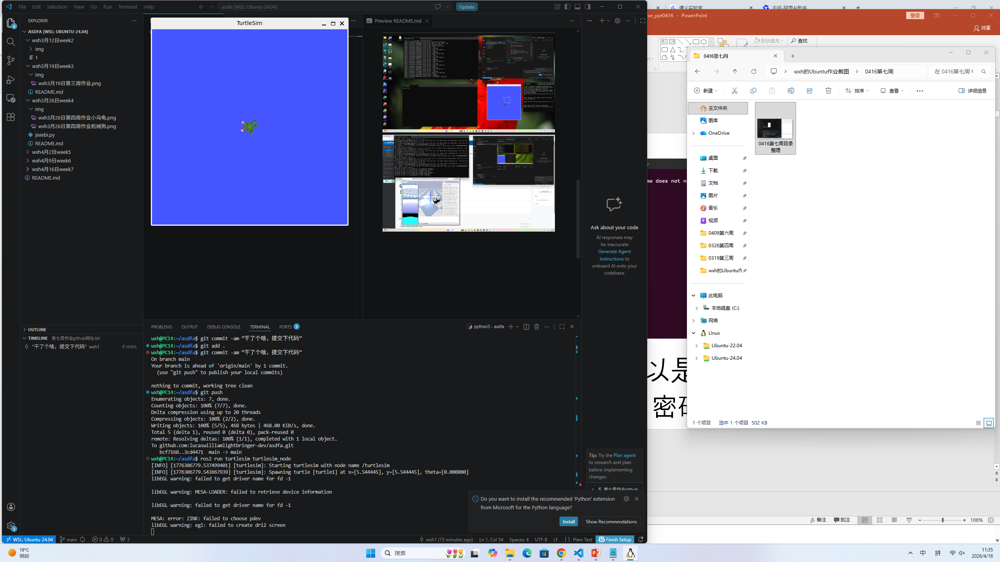
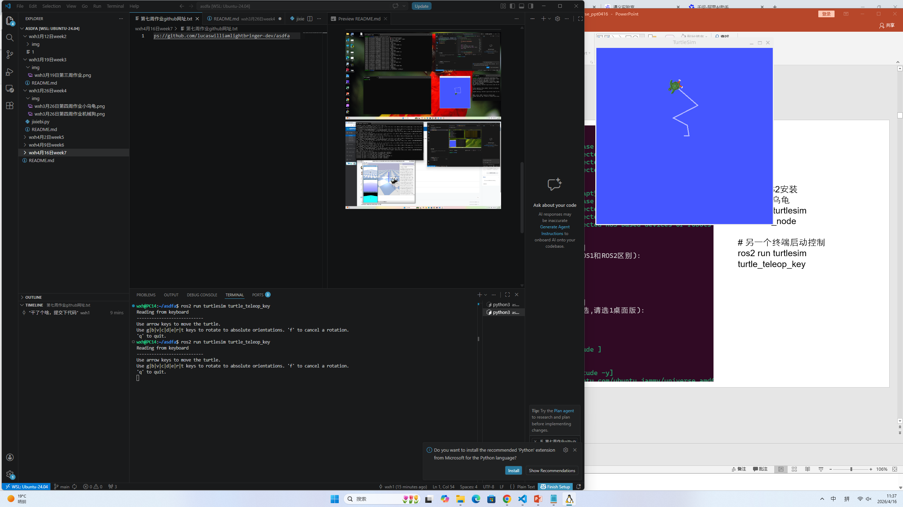

### 📝 课程作业记录与进度汇报

姓名： 王昕昊 (Wang Xinhao)
所属： 信韩大学国际大学软件专业 (Shinhan University | International College | Software Major) 🇰🇷
课程： AI人工智能机器人 (AI Robotics)

---

### 🇨🇳 本次操作叙述 (Description of Activities)

本次主要进行了 Git 版本控制 的操作以及 ROS 2 TurtleSim 的键盘控制测试，具体内容如下：

1. Git 代码提交与同步：
     在 VS Code 的集成终端中，执行了 git commit -am "干了个啥，提交下代码" 命令，将本地修改（包括代码和截图）提交到暂存区。
     随后执行 git push，将本地分支的更改成功推送至 GitHub 远程仓库 (lucaswilliamlightbringer-dev/asdfa)。终端显示 Writing objects: 100% (5/5)... done，表明推送成功。

2. ROS 2 TurtleSim 仿真与键盘控制：
     节点运行： 在 WSL (Ubuntu 24.04) 环境下，执行 ros2 run turtlesim turtlesim_node 启动了海龟仿真节点，并在屏幕上观察到了绿色的海龟。
     键盘遥操作： 启动 ros2 run turtlesim turtle_teleop_key 节点，通过键盘方向键向 /turtle1/cmd_vel 话题发布速度指令。
     运动轨迹： 通过键盘控制，海龟在仿真环境中绘制出了折线轨迹（如第二张图所示），验证了 ROS 2 话题通信机制及键盘控制节点的有效性。

---

### 🇺🇸 English Summary

Name: Wang Xinhao
Activity:
Version Control: Committed local changes with the message "干了个啥，提交下代码" and successfully pushed them to the remote GitHub repository lucaswilliamlightbringer-dev/asdfa.
1. ROS 2 Simulation:
     Ran the turtlesim_node in a WSL environment.
     Utilized the turtle_teleop_key node to control the turtle's movement via keyboard inputs.
     Successfully visualized the turtle drawing a trajectory on the screen, demonstrating the functionality of ROS 2 topic publishing and subscribing.

---

### 🇰🇷 한국어 요약

이름: 왕신호 (Wang Xinhao)
활동 내용:
버전 관리: "干了个啥，提交下代码"라는 메시지와 함께 로컬 변경 사항을 커밋하고, GitHub 원격 저장소(lucaswilliamlightbringer-dev/asdfa)로 푸시(Push)하였습니다.
1. ROS 2 시뮬레이션:
     WSL 환경에서 turtlesim_node를 실행하였습니다.
     turtle_teleop_key 노드를 사용하여 키보드로 거북이의 이동을 제어하였습니다.
     화면상에서 거북이가 궤적을 그리며 이동하는 것을 확인하였으며, 이를 통해 ROS 2의 토픽 통신 기능을 검증하였습니다.

---

