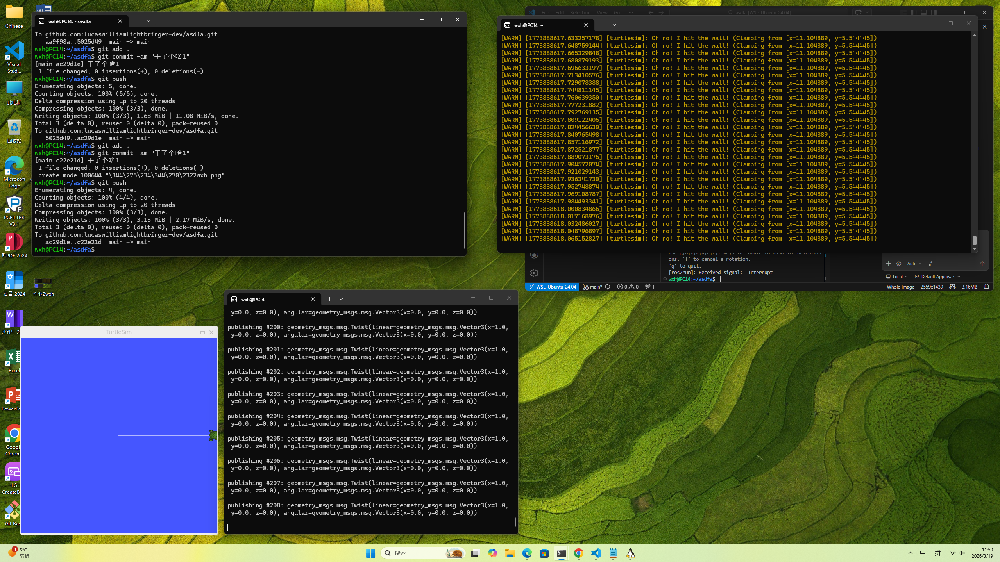

### 📝 课程作业记录与进度汇报

**姓名：** 王昕昊 (Wang Xinhao)
**所属：** 信韩大学国际大学软件专业 (Shinhan University | International College | Software Major) 🇰🇷
**课程：** AI 机器人学 (AI Robotics)

---

#### 🇨🇳 本次操作叙述 (Description of Activities)

本次主要进行了 **ROS 基础通信机制** 的测试以及 **Git 版本控制** 的操作，具体内容如下：

1.  **Git 代码提交与同步：**
    *   在终端中执行了 `git add .` 和 `git commit` 操作，提交信息为 "干了个啥1"。
    *   随后执行 `git push`，将本地更改（包括一个名为 `wxh.png` 的文件）成功推送至 GitHub 远程仓库 (`lucaswilliamlightbringer-dev/asdfa`)。

2.  **ROS TurtleSim 仿真控制：**
    *   **节点运行：** 启动了 `turtlesim` 仿真节点（左下角蓝色窗口），并在屏幕上观察到了绿色的海龟及其运动轨迹。
    *   **消息发布 (Publishing)：** 编写/运行了节点向 `/cmd_vel` 话题发布 `geometry_msgs.msg.Twist` 消息（中下方终端显示）。
    *   **运动控制逻辑：** 设置了线速度 `linear.x = 1.0`，角速度 `angular.z = 0.0`。这意味着控制海龟以 1m/s 的速度沿 X 轴直线前进，不进行转向。
    *   **边界碰撞测试：** 由于持续发送向前的速度指令，海龟移动到了仿真环境的边界。右上角终端输出了大量警告信息：`[WARN] ... [turtlesim]: Oh no! I hit the wall! (Clamping from ...)`。这表明 ROS 的边界限制机制生效，阻止了海龟移出可视区域，验证了仿真环境的物理约束功能。

---

#### 🇺🇸 English Summary

**Name:** Wang Xinhao
**Activity:**
*   **Version Control:** Successfully pushed local commits (including images) to the GitHub repository `lucaswilliamlightbringer-dev/asdfa` using standard Git commands.
*   **ROS Simulation:**
    *   Ran the `turtlesim` node to visualize robot movement.
    *   Published `geometry_msgs/Twist` messages with `linear.x=1.0` to drive the turtle forward.
    *   Observed the "Wall Collision" behavior where the turtle hit the simulation boundary, triggering `[WARN] ... Oh no! I hit the wall!` messages in the console, demonstrating ROS topic communication and simulation constraints.

---

#### 🇰🇷 한국어 요약

**이름:** 왕신호 (Wang Xinhao)
**활동 내용:**
*   **버전 관리:** Git 명령어를 사용하여 로컬 파일을 GitHub 저장소(`lucaswilliamlightbringer-dev/asdfa`)로 푸시(Push)하였습니다.
*   **ROS 시뮬레이션:**
    *   `turtlesim` 노드를 실하여 로봇의 움직임을 시각화하였습니다.
    *   `geometry_msgs/Twist` 메시지를 발행하여 거북이를 직선으로 이동시켰습니다 (`linear.x=1.0`).
    *   거북이가 시뮬레이션 벽에 부딪히는 현상을 관찰하였으며, 콘솔에 `[WARN] ... Oh no! I hit the wall!` 경고 메시지가 출력되는 것을 통해 ROS 통신 및 시뮬레이션 제약 조건을 학습하였습니다.
