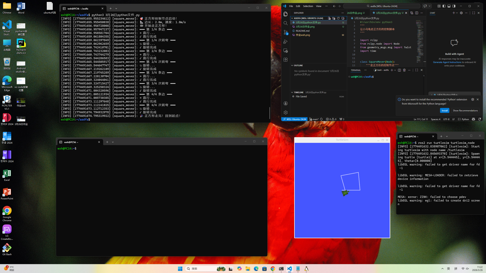
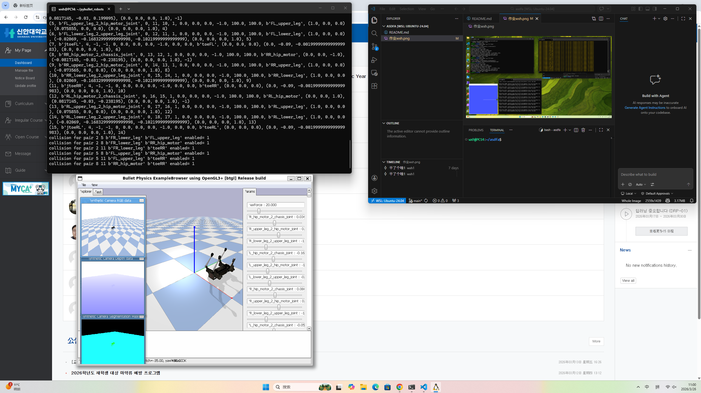

### 📝 课程作业记录与进度汇报

姓名： 王昕昊 (Wang Xinhao)
所属： 信韩大学国际大学软件专业 (Shinhan University | International College | Software Major) 🇰🇷
课程： AI人工智能机器人 (AI Robotics)

---

### 🇨🇳 本次操作叙述 (Description of Activities)

本次主要进行了 四足机器人物理仿真环境搭建 以及 机器人关节碰撞属性配置 的测试，具体内容如下：

1. PyBullet 物理仿真环境配置：
     仿真器启动： 在左上角终端运行了 pybullet_robots 相关脚本，成功启动了 Bullet Physics ExampleBrowser (左下角窗口)。
     场景可视化： 在仿真环境中加载了一个四足机器人模型（类似 Go1 或 Unitree 架构）。界面左侧展示了 Synthetic Camera RGB data（彩色相机视角）、Depth data（深度图）以及 Segmentation Mask（语义分割掩码），这表明正在测试机器人的视觉感知数据采集功能。
     参数调试： 右侧参数栏显示了各个关节（如 hip_motor, upper_leg, lower_leg）的实时状态滑块，用于监控或手动调整机器人姿态。

2. 机器人碰撞矩阵与 URDF 属性调试：
     碰撞检测日志： 左上角终端输出了大量关于碰撞对（collision pair）的调试信息，例如 collision for pair 2 5 b'FR_lower_leg' b'FL_lower_leg' enabled= 1。
     属性配置： 这表明代码正在遍历机器人的各个连杆（Links），显式地启用或禁用特定的碰撞检测对。这是四足机器人开发中关键的一步，用于防止机器人在运动时（如迈步）自身的腿之间发生不必要的物理干涉。

3. 开发环境维护 (VS Code & WSL)：
     代码编辑： 使用 VS Code (右上角) 连接 WSL (Ubuntu-24.04) 环境进行开发。
     版本控制： 在 Git 时间轴中记录了提交 "干了个啥1"，并将作业截图 作业wxh.png 添加到了暂存区，准备提交。

---

### 🇺🇸 English Summary

Name: Wang Xinhao
Activity:
PyBullet Simulation:
    Launched the Bullet Physics ExampleBrowser to simulate a quadruped robot.
    Verified the Synthetic Camera outputs, including RGB, Depth, and Segmentation Mask views, which are essential for computer vision tasks in robotics.
    Monitored joint parameters (Hip, Upper/Lower Leg motors) via the GUI sliders.
Collision Configuration:
    Analyzed terminal logs regarding Collision Pairs.
    The system explicitly enabled collisions between specific robot links (e.g., between Front-Right and Front-Left legs) to ensure accurate physical interaction modeling.
Development Workflow:
    Used VS Code within WSL (Ubuntu) for coding.
    Managed project files and staged screenshots (作业wxh.png) for version control.

---

### 🇰🇷 한국어 요약

이름: 왕신호 (Wang Xinhao)
활동 내용:
PyBullet 시뮬레이션:
    Bullet Physics ExampleBrowser를 실행하여 4족 보행 로봇을 시뮬레이션 환경에 로드하였습니다.
    로봇의 시각 데이터인 RGB, Depth(깊이), Segmentation Mask(분할 마스크) 카메라 출력을 확인하였습니다.
    GUI 슬라이더를 통해 각 관절(Hip, Upper/Lower Leg)의 상태를 모니터링하였습니다.
충돌(Collision) 설정:
    터미널 로그를 통해 로봇의 충돌 쌍(Collision Pairs) 설정을 확인하였습니다.
    로봇의 다리 간 불필요한 물리적 간섭을 방지하거나 의도적인 충돌을 위해 특정 링크(Link) 간의 충돌 감지 기능을 명시적으로 활성화(enabled=1)하는 작업을 수행하였습니다.
개발 환경:
    WSL (Ubuntu) 환경에서 VS Code를 사용하여 코드를 작성하고Git 커밋을 준비하였습니다.

---

