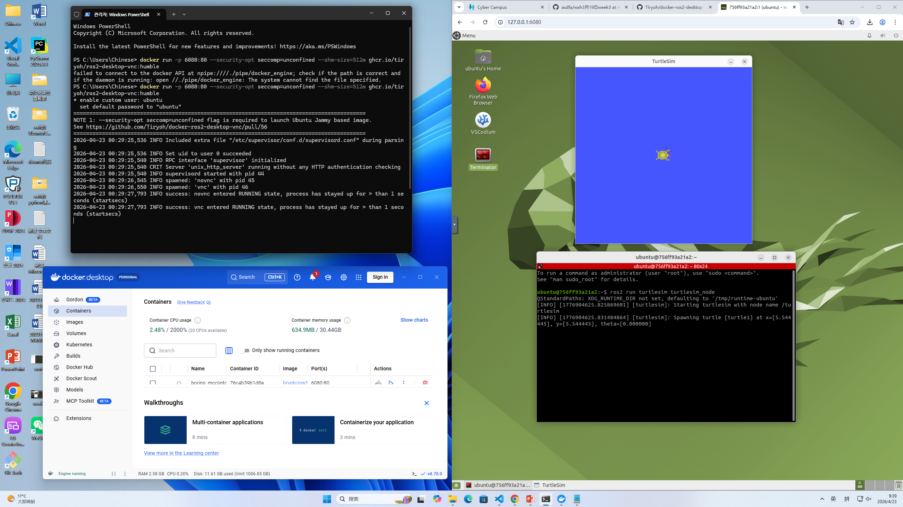
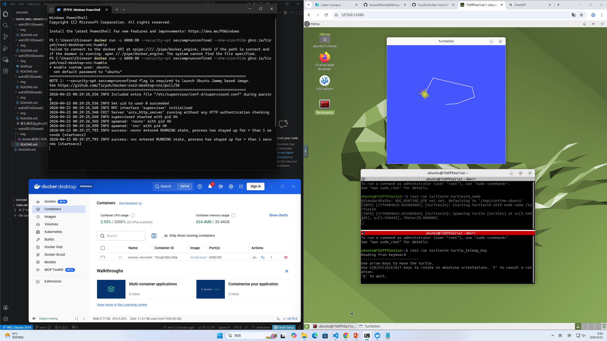

### 📝 课程作业记录与进度汇报

姓名： 王昕昊 (Wang Xinhao)
所属： 信韩大学国际大学软件专业 (Shinhan University | International College | Software Major) 🇰🇷
课程： AI人工智能机器人 (AI Robotics)

---

### 🇨🇳 本次操作叙述 (Description of Activities)

本次主要进行了 **Docker 容器环境下的 ROS2 仿真运行与键盘控制测试**，并成功实现了 TurtleSim 图形交互控制，具体内容如下：

1. Docker + ROS2 仿真环境搭建：
   容器启动： 在左侧 Windows PowerShell 中执行 `docker run -p 6080:80 --security-opt seccomp=unconfined --shm-size=512m ghcr.io/ti.../ros2-desktop-vnc:humble` 命令，成功启动基于 Ubuntu Jammy 的 ROS2 Desktop 容器。
   远程桌面访问： 通过浏览器访问 `127.0.0.1:6080`，进入基于 noVNC 的 Ubuntu 桌面环境，实现容器内图形界面的可视化操作。
   服务日志： 终端日志显示 `novnc` 与 `vnc` 服务均成功进入 RUNNING 状态，说明远程图形服务正常运行。

2. ROS2 TurtleSim 仿真测试：
   节点运行： 在容器终端中执行 `ros2 run turtlesim turtlesim_node`，成功启动 TurtleSim 仿真节点。
   仿真界面： 弹出了 TurtleSim 窗口（蓝色背景），中心显示一只小乌龟，说明 ROS2 图形节点运行正常。
   日志信息： 终端输出了节点启动信息，包括 turtle 生成位置 `(x≈5.54, y≈5.54, theta=0)`，验证了仿真初始化成功。

3. TurtleSim 键盘控制（新增）：
   控制节点运行： 在新的终端中执行 `ros2 run turtlesim turtle_teleop_key`，启动键盘控制节点。
   控制方式： 使用键盘方向键（↑ ↓ ← →）控制小乌龟移动，使用 `G B V C D E R T` 等键控制旋转方向。
   轨迹绘制： 在 TurtleSim 窗口中成功绘制出不规则轨迹（类似多边形路径），说明速度指令（cmd_vel）已正确发布并被仿真节点接收。
   交互验证： 终端提示 “Reading from keyboard”，表明 teleop 节点正常监听输入，实现了 ROS2 节点之间的通信与控制闭环。

4. Docker Desktop 管理与监控：
   容器状态： 在 Docker Desktop 界面中可以看到正在运行的容器（映射端口 6080:80）。
   资源使用： 界面显示容器 CPU 和内存占用情况，说明容器运行稳定。
   可视化管理： 通过 Docker Desktop 对容器进行统一管理和监控，提高开发效率。

---

### 🇺🇸 English Summary

Name: Wang Xinhao

Activity:

Docker + ROS2 Environment:
Launched a ROS2 desktop container using Docker with VNC support.
Accessed the container GUI via browser (noVNC) at localhost:6080.
Verified that VNC and noVNC services were running successfully.

ROS2 Simulation (TurtleSim):
Executed `ros2 run turtlesim turtlesim_node` to start the simulation node.
Confirmed the TurtleSim GUI window appeared with a turtle in the center.
Checked initialization logs including turtle spawn position.

Keyboard Control (Teleop):
Ran `ros2 run turtlesim turtle_teleop_key` to enable keyboard control.
Used arrow keys to move the turtle and rotation keys to change orientation.
Successfully drew trajectories in the simulator, confirming correct topic communication.

Docker Management:
Monitored container status and resource usage via Docker Desktop.
Ensured stable execution and proper port mapping for GUI access.

---

### 🇰🇷 한국어 요약

이름: 왕신호 (Wang Xinhao)

활동 내용:

Docker 및 ROS2 환경:
Docker를 사용하여 ROS2 Desktop 컨테이너를 실행하였으며 VNC 기반 GUI 환경을 구성하였습니다.
브라우저(127.0.0.1:6080)를 통해 컨테이너 내부 Ubuntu 데스크탑에 접속하였습니다.
VNC 및 noVNC 서비스가 정상적으로 실행됨을 확인하였습니다.

TurtleSim 시뮬레이션:
`ros2 run turtlesim turtlesim_node` 명령어로 시뮬레이션을 실행하였습니다.
TurtleSim GUI 창이 정상적으로 표시되고 중앙에 거북이가 생성됨을 확인하였습니다.

키보드 제어 (추가):
`ros2 run turtlesim turtle_teleop_key` 명령어로 키보드 제어 노드를 실행하였습니다.
방향키를 사용하여 거북이를 이동시키고 다양한 궤적을 생성하였습니다.
이를 통해 ROS2 노드 간 통신이 정상적으로 이루어짐을 확인하였습니다.

개발 환경:
Docker Desktop을 통해 컨테이너 상태 및 자원 사용량을 모니터링하였습니다.
컨테이너 기반 ROS2 개발 환경이 안정적으로 동작함을 확인하였습니다.

---

