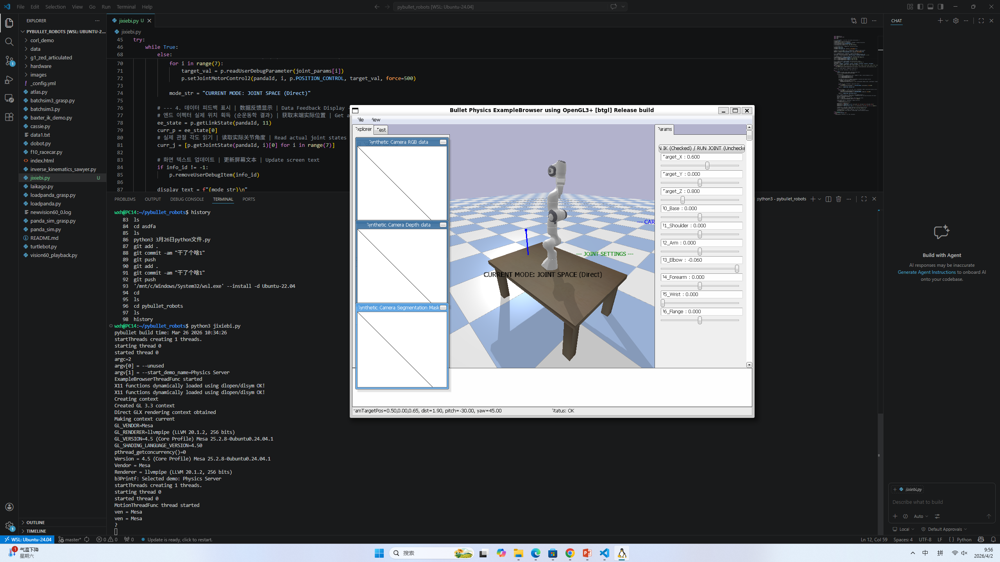

### 📝 课程作业记录与进度汇报

姓名： 王昕昊 (Wang Xinhao)
所属： 信韩大学国际大学软件专业 (Shinhan University | International College | Software Major) 🇰🇷
课程： AI人工智能机器人 (AI Robotics)

---

### 🇨🇳 本次操作叙述 (Description of Activities)

本次主要进行了 PyBullet 机器人物理仿真 以及 逆运动学 (IK) 控制代码 的调试，具体内容如下：

1. PyBullet 仿真环境运行：
     在 WSL (Ubuntu) 终端中运行了 python3 jixiebi.py 脚本，成功启动了 Bullet Physics ExampleBrowser。
     仿真场景中加载了一个 Franka Emika Panda 机械臂模型，并将其放置在一张桌子（平面）上方。
     界面右侧的 Params 面板显示了 target_x, target_y, target_z 等滑块，表明当前处于 逆运动学 (IK) 控制模式，可以通过调整目标坐标来控制机械臂末端执行器的位置。

2. Python 代码逻辑调试 (VS Code)：
     运动控制循环： 在 jixiebi.py 中编写了 while True 循环，利用 p.setJointMotorControl2 函数对机械臂的 7 个关节进行位置控制 (POSITION_CONTROL)。
     状态读取与反馈： 代码中包含 p.getLinkState 和 p.getJointState 调用，用于实时获取机械臂末端执行器的实际位置和关节角度，实现了仿真环境中的数据反馈。
     调试参数： 使用 p.readUserDebugParameter 读取仿真器界面中的滑块值，将其作为目标位置输入给控制算法。

3. Git 版本控制操作：
     在终端历史记录中可以看到执行了 git add .、git commit -am "干了个啥1" 以及 git push 命令。
     这表明已将编写的机械臂控制代码及项目文件提交并同步到了远程代码仓库。

---

### 🇺🇸 English Summary

Name: Wang Xinhao
Activity:
1.PyBullet Simulation:
     Executed jixiebi.py to launch the Bullet Physics simulation environment featuring a Panda robot arm.
     Configured the simulation for Inverse Kinematics (IK) control, visualizing the robot arm positioned above a table.
     Utilized the GUI parameter sliders to set target coordinates (target_x, y, z) for the end-effector.
2. Code Implementation:
     Implemented a control loop in Python using p.setJointMotorControl2 for position control.
     Integrated state feedback logic using p.getLinkState to monitor the robot's actual pose in real-time.
3. Version Control:
     Committed local changes with the message "干了个啥1" and pushed the code to the remote Git repository.

---

### 🇰🇷 한국어 요약

이름: 왕신호 (Wang Xinhao)
활동 내용:
1. PyBullet 시뮬레이션:
     jixiebi.py 스크립트를 실행하여 판다(Panda) 로봇 팔이 포함된 Bullet Physics 시뮬레이션 환경을 구동하였습니다.
     역운동학(IK) 제어를 설정하고, GUI 파라미터 슬라이더를 사용하여 로봇 팔의 목표 좌표를 조절하였습니다.
2. 코드 구현:
     Python 제어 루프를 구현하여 p.setJointMotorControl2를 통해 관절 위치를 제어하였습니다.
     p.getLinkState를 사용하여 로봇의 실제 상태를 실시간으로 모니터링하는 피드백 로직을 적용하였습니다.
3. 버전 관리:
     "干了个啥1" 메시지로 로컬 코드를 커밋하고 원격 Git 저장소에 푸시(Push)하였습니다.

---

