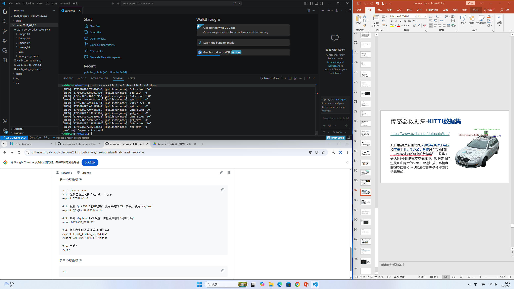
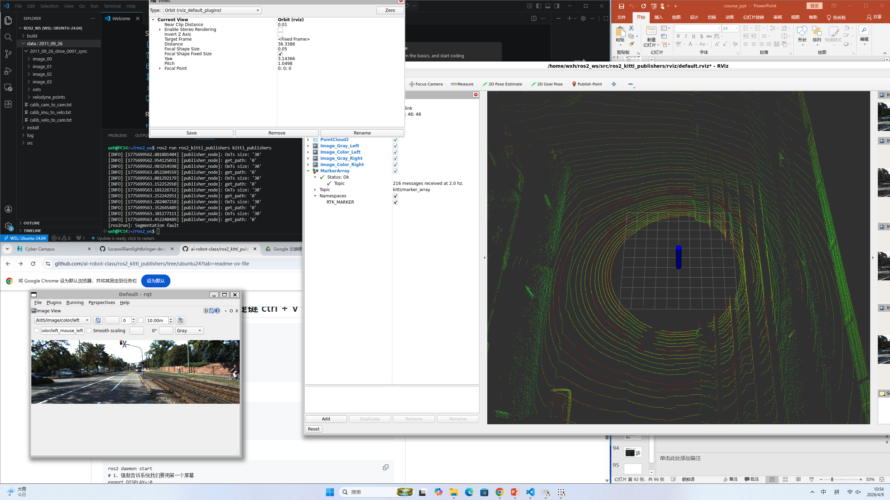
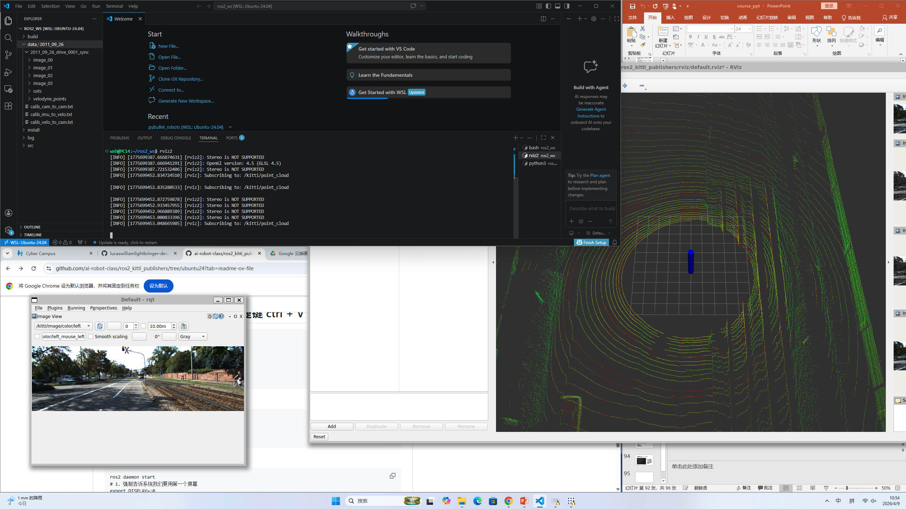
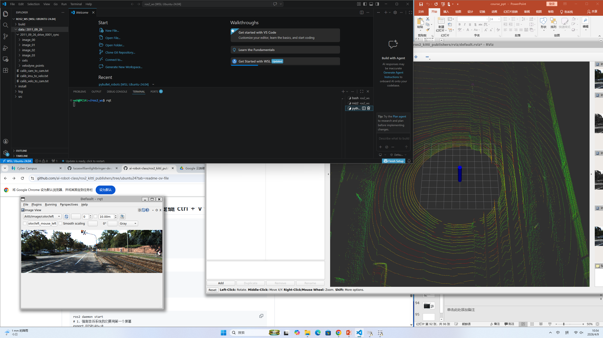
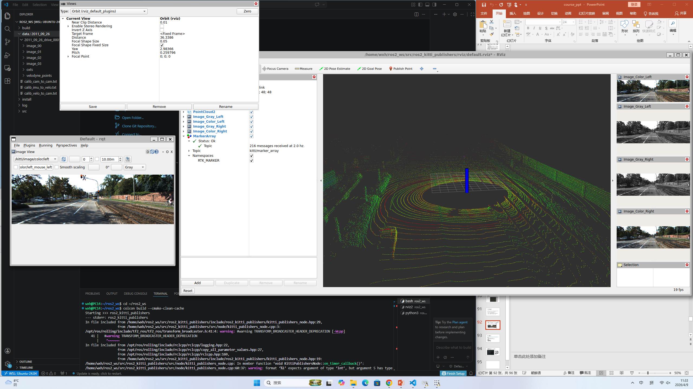
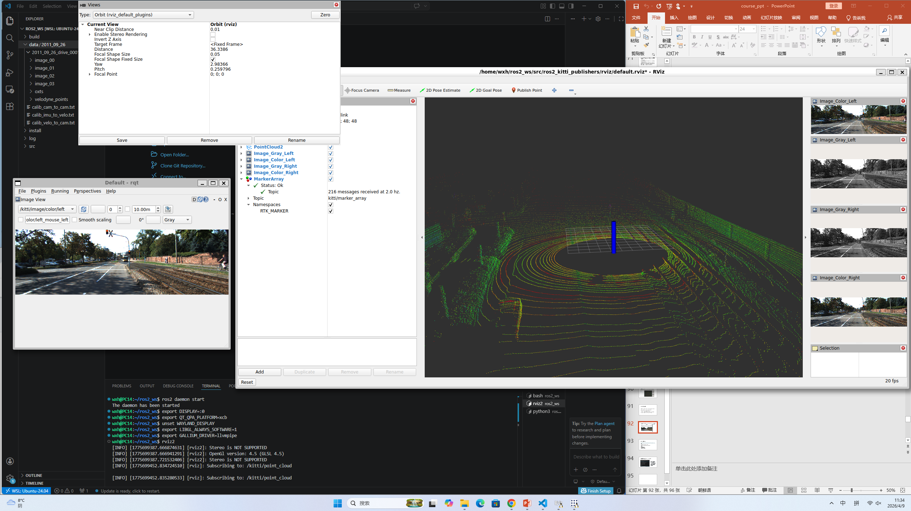
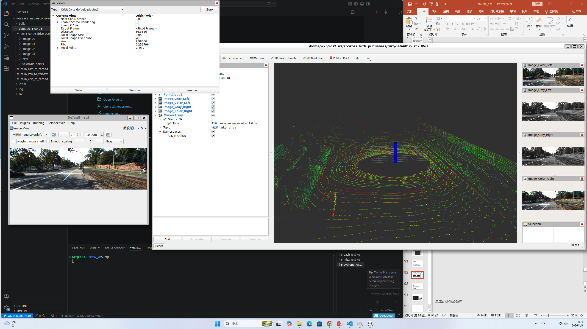

### 📝 课程作业记录与进度汇报

姓名： 王昕昊 (Wang Xinhao)
所属： 信韩大学国际大学软件专业 (Shinhan University | International College | Software Major) 🇰🇷
课程： AI 机器人学 (AI Robotics)

---

### 🇨🇳 本次操作叙述 (Description of Activities)

本次主要进行了 KITTI 自动驾驶数据集 在 ROS 2 环境 下的可视化与多传感器数据融合测试，具体内容如下：

1. KITTI 数据集 ROS 2 节点发布：
     在 VS Code 终端中运行了 ros2 run ros2_kitti_publishers kitti_publishers 命令，启动了 KITTI 数据发布节点。
     终端日志显示节点成功运行，循环发布图像和点云数据（例如 Oxts size: '30', get_path: '0'），但在运行结束时出现了 Segmentation fault（段错误），提示需要进一步排查内存访问问题。

2. RViz2 点云与图像可视化：
     启动 rviz2 加载配置文件，成功可视化了 Velodyne 激光雷达点云（右侧大窗口）。点云呈现出典型的道路场景，能够清晰看到路面、路边树木及建筑物的三维结构。
     启动 rqt 图像视图，订阅了 /kitti/image/color/left 话题，成功显示了与点云对应的 左侧彩色相机图像（左下角窗口），画面显示为一条城市道路，包含红绿灯和铁轨。
     在 RViz 中添加了多个 Image 显示项，同时展示了左/右灰度图和彩色图，验证了双目视觉数据的同步发布。

3. 代码编译与调试：
     使用 colcon build 对工作空间进行编译。
     终端输出显示编译过程中存在警告信息：warning: format ‘%i’ expects argument of type ‘int’, but argument 5 has type...，表明在 C++ 代码 (kitti_publishers_node.cpp) 的日志打印或字符串格式化部分存在类型不匹配问题，需进行修正。

---

### 🇺🇸 English Summary

Name: Wang Xinhao
Activity:
1. KITTI Dataset Visualization:
     Executed the kitti_publishers node in ROS 2 to stream the KITTI dataset.
     RViz2: Visualized 3D LiDAR point clouds (Velodyne)  showing road and environmental structures.
     Rqt: Displayed real-time camera feeds (/kitti/image/color/left), verifying the synchronization between camera images and LiDAR data.
2. Code Compilation:
     Built the workspace using colcon build.
     Identified a C++ compilation warning regarding format string type mismatch (%i vs argument type) in kitti_publishers_node.cpp.
     Noted a Segmentation fault upon node termination, indicating a need for debugging memory management.

---

### 🇰🇷 한국어 요약

이름: 왕신호 (Wang Xinhao)
활동 내용:
1. KITTI 데이터셋 시각화:
     ROS 2 환경에서 kitti_publishers 노드를 실행하여 KITTI 데이터셋을 스트리밍하였습니다.
     RViz2: Velodyne 라이다의 3D 점군(Point Cloud)을 시각화하여 도로 및 주변 환경 구조를 확인하였습니다.
     Rqt: 실시간 카메라 영상(/kitti/image/color/left)을 표시하여 카메라와 라이다 데이터의 동기화를 검증하였습니다.
2. 코드 컴파일:
     colcon build 명령어를 사용하여 워크스페이스를 빌드하였습니다.
     kitti_publishers_node.cpp 파일에서 형식 문자열 유형 불일치(%i 대 인자 유형)와 관련된 C++ 컴파일 경고를 확인하였습니다.
     노드 종료 시 Segmentation fault가 발생하는 것을 확인하여, 향후 메모리 관리 디버깅이 필요함을 파악하였습니다.

---

