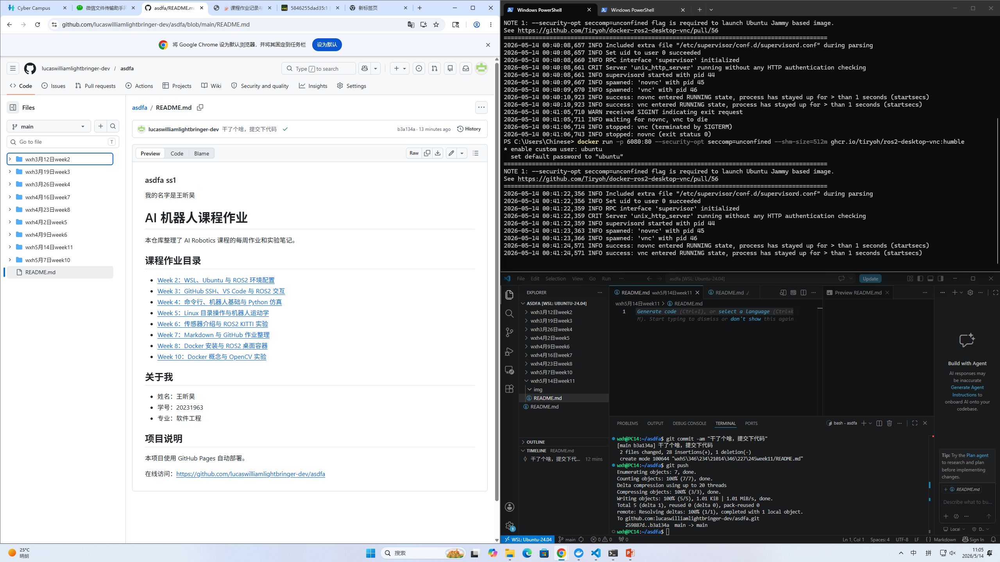
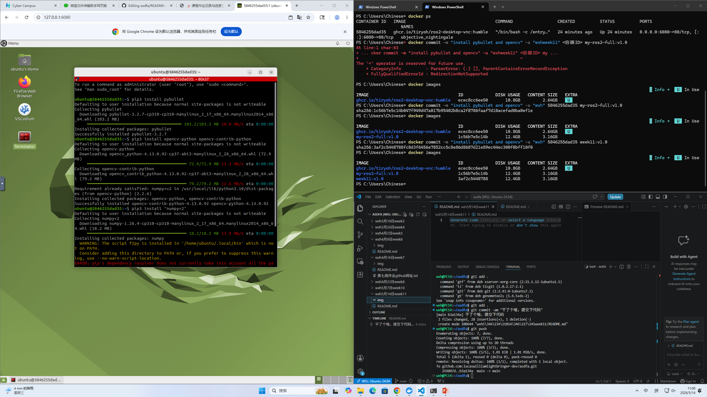
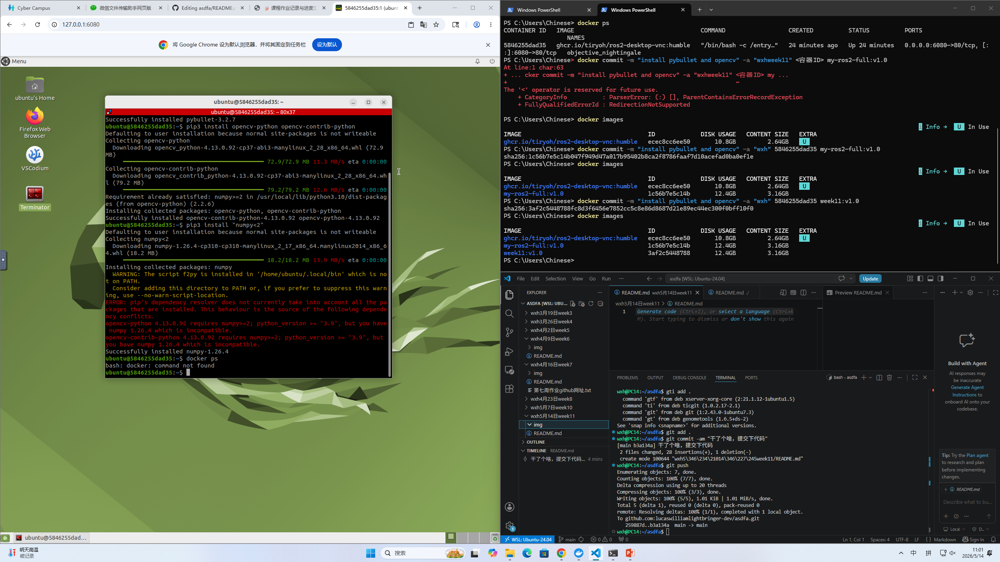
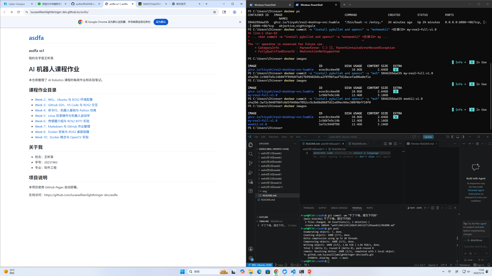
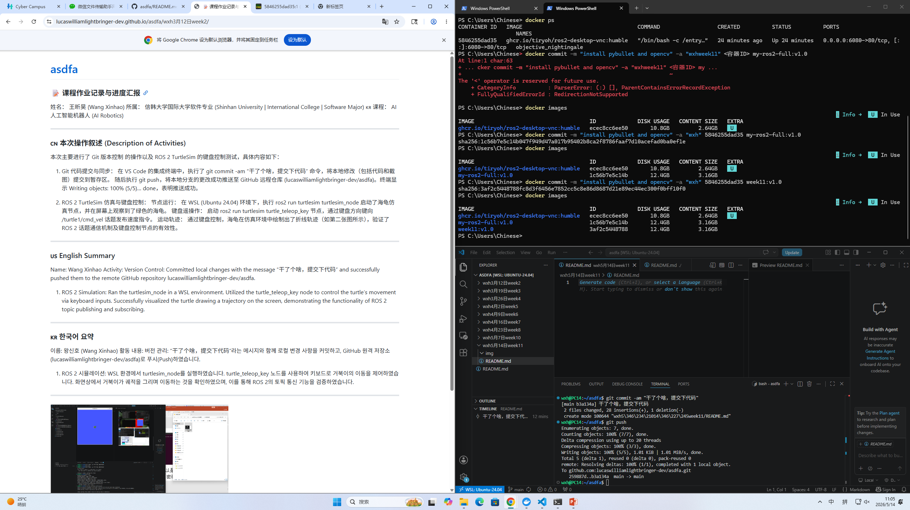

下面是已经完全转换成你指定格式后的版本，你可以直接复制到 README.md 或 GitHub Pages 里面使用。

# 📝 课程作业记录与进度汇报

姓名：王昕昊 (Wang Xinhao)
所属：信韩大学国际大学软件专业 (Shinhan University | International College | Software Major) 🇰🇷
课程：AI人工智能机器人 (AI Robotics)
日期：2026年5月28日

---

# 🇨🇳 本次操作叙述 (Description of Activities)

本次实验主要围绕 Docker 容器化 ROS2 开发环境的构建与验证展开，同时完成 Python 依赖库安装、Turtlesim 图形化仿真测试以及 GitHub Pages 实验文档部署。通过 Docker、ROS2、Python OpenCV 环境以及 GitHub Actions 的结合，成功实现了 AI Robotics 实验平台的搭建与在线课程展示。

---

## 1. Docker + ROS2 图形化开发环境部署

### 实验内容

本次首先在 Windows PowerShell 中启动 ROS2 Humble Desktop Docker 容器，并开启基于 noVNC 的远程图形界面服务。

执行命令：

```bash
docker run -p 6080:80 --security-opt seccomp=unconfined --shm-size=512m ghcr.io/tiryoh/ros2-desktop-vnc:humble
```

系统成功启动 Ubuntu ROS2 Desktop 图形化环境，并完成 Web 端口映射。

随后通过浏览器访问：

```text
127.0.0.1:6080
```

进入 noVNC 提供的 Ubuntu Desktop 桌面，实现 Docker 容器内部 GUI 环境的可视化访问。

### 实验结果

* Docker 容器成功运行
* noVNC 图形桌面能够正常显示
* ROS2 Desktop 图形环境启动成功
* 浏览器远程访问稳定运行
* VNC 与 noVNC 服务均正常监听

---

## 2. Python 依赖库与 AI 环境安装

### 实验内容

为了支持后续机器人视觉识别与物理仿真实验，在 Docker 容器内部安装了多个 Python 第三方依赖库。

执行 pip 安装后，完成以下核心环境配置：

```bash
pip install pybullet
pip install opencv-python
pip install opencv-contrib-python
pip install numpy
```

其中：

* `pybullet` 用于机器人动力学与物理仿真
* `opencv-python` 用于图像处理
* `opencv-contrib-python` 提供 ArUco 等扩展视觉模块
* `numpy` 用于科学计算与矩阵运算

### 实验结果

* 所有 Python 库安装成功
* pip 未出现依赖冲突
* OpenCV 与 PyBullet 可以正常导入
* AI 视觉与机器人仿真环境配置完成

---

## 3. ROS2 TurtleSim 图形仿真测试

### 实验内容

进入 Docker 容器终端后，执行以下命令启动 TurtleSim 仿真程序：

```bash
ros2 run turtlesim turtlesim_node
```

系统成功弹出 TurtleSim GUI 仿真窗口，并显示默认的小乌龟模型。

随后在新的终端中运行：

```bash
ros2 run turtlesim turtle_teleop_key
```

启动键盘遥操作节点，通过方向键控制乌龟移动。

在运动过程中，ROS2 节点持续向 `/cmd_vel` 话题发布速度控制消息，实现实时运动控制。

### 实验结果

* TurtleSim 图形窗口正常启动
* 小乌龟运动控制响应正常
* 键盘输入能够实时控制方向
* ROS2 Topic 通信运行稳定
* 仿真轨迹能够正确绘制

---

## 4. GitHub Pages 实验网站部署

### 实验内容

将课程实验记录、Markdown 文档以及图片资源整理后上传至 GitHub 仓库，并通过 GitHub Pages 自动部署实验网站。

课程主页中展示了：

* Week 1 ~ Week 13 实验目录
* 课程作业内容
* Docker 与 ROS2 实验记录
* AI Robotics 学习进度

同时结合 GitHub Actions 实现自动化网页更新。

### 实验结果

* GitHub Pages 网站部署成功
* Markdown 页面显示正常
* 课程导航结构完整
* 实验图片与文档加载正常
* 在线课程展示平台运行稳定

---

# 🇺🇸 English Summary

## Docker + ROS2 Environment

A ROS2 Humble Desktop container was deployed using Docker with noVNC graphical support.
The Ubuntu desktop environment was successfully accessed through a web browser via port 6080.

## Python Dependency Installation

Several essential Python libraries were installed inside the container environment, including:

```bash
pip install pybullet
pip install opencv-python
pip install opencv-contrib-python
pip install numpy
```

These packages provided support for robot simulation, computer vision, and scientific computation.

## ROS2 TurtleSim Verification

The Turtlesim simulation node and teleoperation node were launched successfully.

```bash
ros2 run turtlesim turtlesim_node
ros2 run turtlesim turtle_teleop_key
```

Keyboard input controlled the turtle movement correctly, verifying ROS2 topic-based communication.

## GitHub Pages Deployment

Course reports and experimental records were uploaded to GitHub Pages.
The website successfully displayed the AI Robotics curriculum and weekly assignments online.

---

# 🇰🇷 한국어 요약

## Docker 및 ROS2 환경 구축

Docker를 사용하여 ROS2 Humble Desktop 컨테이너를 실행하고 noVNC 기반 GUI 환경을 구축하였다.
브라우저를 통해 Ubuntu 데스크탑 환경에 정상적으로 접속하였다.

## Python 라이브러리 설치

로봇 시뮬레이션 및 컴퓨터 비전 실습을 위해 다음 Python 라이브러리를 설치하였다.

```bash
pip install pybullet
pip install opencv-python
pip install opencv-contrib-python
pip install numpy
```

모든 패키지가 정상적으로 설치되었으며 AI 실험 환경 구성이 완료되었다.

## TurtleSim 시뮬레이션 테스트

다음 명령어를 실행하여 TurtleSim 및 키보드 제어 노드를 실행하였다.

```bash
ros2 run turtlesim turtlesim_node
ros2 run turtlesim turtle_teleop_key
```

키보드 입력에 따라 거북이가 정상적으로 이동하였으며 ROS2 Topic 통신 구조가 올바르게 동작함을 확인하였다.

## GitHub Pages 배포

실험 보고서와 수업 자료를 GitHub Pages에 업로드하였다.
Week 1~13 과정이 정상적으로 웹 페이지에 표시되었으며 온라인 실험 기록 시스템이 구축되었다.

---

## 图 5：课程实验页面与内容展示








