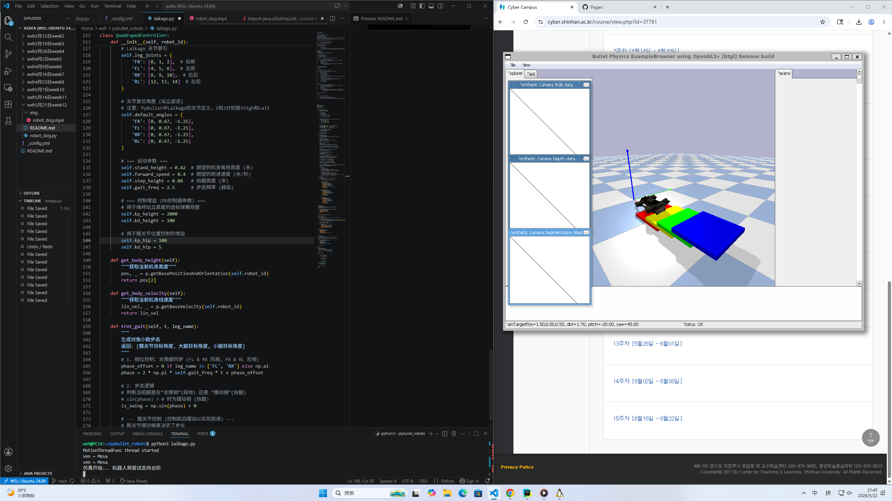

# 📝 AI Robotics 实验进度报告

姓名：王昕昊（Wang Xinhao）
学校：信韩大学 国际学院 软件专业（Shinhan University · International College · Software Engineering）🇰🇷
课程名称：Artificial Intelligence Robotics
实验日期：2026年5月28日

---

# 🇨🇳 实验内容说明（Experiment Overview）

本次课程实践主要围绕 PyBullet 机器人仿真平台展开，重点完成了四足机器人运动控制程序的调试与运行。通过 VS Code 在 WSL Ubuntu 环境中编写 Python 控制代码，并结合 PyBullet GUI 完成机器人运动仿真与可视化测试。

实验过程中成功实现：

* Python 仿真程序运行
* 四足机器人模型加载
* PyBullet 图形界面启动
* 机器人步态参数调节
* 仿真摄像头数据显示
* Linux + VS Code 联合开发环境测试

整个实验验证了 Python 机器人控制逻辑与物理仿真系统之间的协同运行能力。

---

# 1. Ubuntu + VS Code 开发环境配置

## 实验过程

本次实验首先在 Windows 系统下启动 WSL Ubuntu 24.04 环境，并通过 VS Code Remote 功能连接 Linux 工作目录。

在 VS Code 中打开 `pybullet_robots` 项目后，对机器人控制脚本进行了编辑与调试，包括：

* 四足机器人类定义
* 电机关节参数
* 步态控制逻辑
* PID 高度控制参数
* 行走频率与摆动参数

Python 文件中对机器人腿部进行了分组控制，包括：

```python
'FR' : [0,1,2]
'FL' : [4,5,6]
'RR' : [8,9,10]
'RL' : [12,13,14]
```

同时设置机器人默认站立姿态与步态运动周期。

## 实验结果

* 成功连接 WSL Ubuntu 开发环境
* VS Code 可以直接编辑 Linux 项目文件
* Python 程序能够正常保存与运行
* 机器人运动参数配置完成

---

# 2. PyBullet 四足机器人仿真运行

## 实验过程

在 Ubuntu 终端中执行：

```bash
python3 laikago.py
```

启动 PyBullet 四足机器人仿真程序。

程序运行后，系统自动加载：

* PyBullet Physics Engine
* OpenGL 图形界面
* 四足机器人模型
* 地面与障碍平台

右侧窗口中显示机器人模型位于彩色平台区域，同时左侧显示：

* RGB Camera Data
* Depth Data
* Segmentation Mask

用于模拟机器人视觉传感器数据。

终端输出：

```text
MotionThreadFunc thread started
```

表明机器人运动线程已经启动。

## 实验结果

* PyBullet GUI 成功打开
* 四足机器人模型正常加载
* 摄像头模拟数据正常显示
* 机器人运动线程运行稳定
* 地面物理碰撞检测正常

---

# 3. 四足机器人运动控制测试

## 实验过程

本次实验对机器人步态算法进行了测试。

程序中通过：

* 相位控制（Phase Offset）
* 正弦函数运动生成
* 摆动腿与支撑腿切换
* PID 高度稳定控制

实现机器人周期性行走控制。

代码中通过：

```python
phase = 2 * np.pi * self.gait_freq * t
```

计算步态周期，并依据不同腿部进行同步或反向控制。

同时设置：

```python
self.step_height = 0.08
self.forward_speed = 0.4
```

用于调节机器人前进速度与抬腿高度。

## 实验结果

* 四足机器人能够完成连续运动
* 步态切换逻辑运行正常
* 机器人保持基本稳定状态
* 参数调节能够影响运动效果
* 成功验证机器人运动控制算法

---

# 4. 图形化仿真与实时观察

## 实验过程

实验过程中使用 PyBullet 自带 OpenGL GUI 对机器人运动状态进行实时观察。

仿真界面中可以查看：

* 机器人姿态变化
* 摄像头视角
* 深度图像
* 地面碰撞情况
* 平台障碍结构

同时能够通过鼠标旋转视角，对机器人运动过程进行动态分析。

## 实验结果

* 图形界面运行流畅
* 摄像头数据实时更新
* 机器人运动轨迹清晰
* 视觉仿真效果稳定
* OpenGL 渲染正常工作

---

# 🇺🇸 English Summary

## Linux + VS Code Development

The experiment was conducted in a WSL Ubuntu environment using VS Code Remote Development.
Python scripts for quadruped robot control were edited and tested successfully.

## PyBullet Robot Simulation

The following command was executed:

```bash
python3 laikago.py
```

The PyBullet simulator launched successfully with a quadruped robot model and OpenGL GUI interface.
RGB, depth, and segmentation camera data were displayed correctly.

## Robot Motion Control

A gait control algorithm based on sinusoidal phase motion and PID stabilization was implemented.
The robot performed continuous walking movements with adjustable speed and step height parameters.

## Visualization and Monitoring

The PyBullet graphical interface allowed real-time observation of robot posture, collision behavior, and simulated camera outputs.
The physics simulation operated stably during the entire experiment.

---

# 🇰🇷 한국어 요약

## Ubuntu 및 VS Code 개발 환경

WSL Ubuntu 환경에서 VS Code Remote 기능을 사용하여 로봇 제어 코드를 수정하고 실행하였다.
Python 기반 4족 보행 로봇 제어 프로그램이 정상적으로 동작하였다.

## PyBullet 로봇 시뮬레이션

다음 명령어를 실행하였다.

```bash
python3 laikago.py
```

PyBullet GUI 창이 정상적으로 실행되었으며 4족 로봇 모델과 OpenGL 기반 시뮬레이션 화면이 표시되었다.

## 보행 제어 테스트

PID 제어와 위상 기반 보행 알고리즘을 사용하여 로봇의 이동 동작을 구현하였다.
보행 속도와 다리 움직임 파라미터를 조절하면서 다양한 움직임을 테스트하였다.

## 그래픽 시각화

RGB 카메라, Depth 데이터, Segmentation Mask가 정상적으로 출력되었으며 물리 시뮬레이션 환경이 안정적으로 유지되었다.

---

<video src="img/robot_dog.mp4" controls></video>
