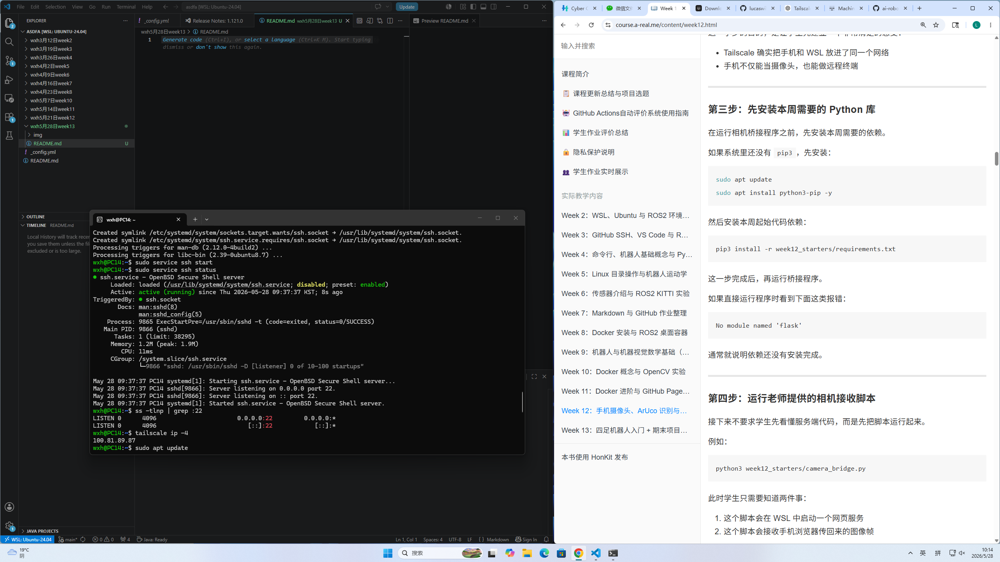

# 📝 Week 12 基于Tailscale与Flask的手机端ArUco标记实时识别系统实验


姓名：王昕昊（Wang Xinhao）
学校：Shinhan University 国际学院 软件专业 🇰🇷
课程名称：AI Robotics & Vision System
实验日期：2026年5月28日

---

# 🇨🇳 实验内容概述（Experiment Overview）

本周实验重点围绕手机摄像头远程接入、Tailscale 网络互联、Flask 图像流服务以及 ArUco 标记识别系统展开。
通过 WSL Ubuntu 环境与移动端设备的结合，实现了基于局域虚拟网络的实时图像采集与识别测试，并完成了 ArUco Marker 的检测、ID 验证以及图像保存功能。

整个实验过程同时涉及：

* Ubuntu WSL 开发环境
* VS Code 远程开发
* Flask Web 摄像头服务
* Tailscale 内网穿透
* OpenCV ArUco 识别
* 手机浏览器实时访问
* Python 依赖环境配置

---

# 1. Ubuntu + VS Code 开发环境准备

## 实验过程

首先在 Windows 系统中启动 Ubuntu 24.04 WSL 环境，并通过 VS Code 连接 Linux 工作区。
随后创建 `week12_starters` 项目目录，并导入课程所提供的 Python 依赖文件。

实验过程中完成了：

```bash
mkdir week12_starters
```

以及 Python 虚拟环境初始化：

```bash
python3 -m venv venv
source venv/bin/activate
```

同时在 Ubuntu 中安装本周实验所需依赖库，包括：

* Flask
* OpenCV
* NumPy
* SocketIO 等模块

---

## 实验结果

* WSL Ubuntu 运行正常
* VS Code 成功连接 Linux 环境
* Python 虚拟环境创建成功
* requirements.txt 依赖安装完成
* Week12 项目目录构建完成

---

# 2. Tailscale 网络互联配置

## 实验过程

本次实验使用 [Tailscale 官方网站](https://tailscale.com?utm_source=chatgpt.com) 构建跨设备虚拟局域网。

在 Ubuntu 中安装并启动 Tailscale：

```bash
curl -fsSL https://tailscale.com/install.sh | sh
sudo tailscale up
```

系统随后分配虚拟网络 IP：

```text
100.81.89.87
```

手机端与 WSL Ubuntu 同时加入同一 Tailnet 网络，实现跨设备访问。

---

## 实验结果

* Tailscale 安装成功
* Ubuntu 成功获取虚拟 IP
* 手机能够访问 Ubuntu 服务
* 实现移动端与 WSL 的网络互通
* 为后续摄像头实时传输提供网络基础

---

# 3. Flask 摄像头图像流测试

## 实验过程

运行课程提供的 Flask 摄像头桥接脚本：

```bash
python3 week12_starters/camera_bridge.py
```

系统自动启动 Web 服务：

```text
http://100.81.89.87:5000
```

随后在手机浏览器中访问该地址，并授权手机摄像头权限。

服务器终端实时输出：

```text
GET /preview.jpg
POST /socket.io/
```

说明 Flask 与 SocketIO 数据通信工作正常。

---

## 实验结果

* 手机摄像头成功接入
* 浏览器实时画面传输正常
* Flask 服务稳定运行
* SocketIO 持续传输图像帧
* Ubuntu 成功接收移动端视频流

---

# 4. ArUco Marker 识别实验

## 实验过程

本阶段使用 OpenCV ArUco 模块进行视觉识别测试。

首先通过在线生成器生成：

```text
4x4 Dictionary
Marker ID = 0
```

的 ArUco 标记图案，并在手机摄像头中进行实时检测。

系统自动识别：

* Marker 边框
* Marker ID
* 目标数量
* 匹配状态

页面实时输出：

```text
Detected: 1
Rejected: 5
Expected ID: 6
Matched expected: false
```

同时系统支持：

```text
保存当前帧
```

功能，用于后续标定与数据分析。

---

## 实验结果

* 成功检测到 ArUco Marker
* OpenCV 识别功能正常运行
* 实时 ID 检测成功
* 图像保存功能正常
* 手机摄像头与视觉算法联调成功

---

# 5. 实验中遇到的问题与解决

## Python 环境限制问题

Ubuntu 24.04 中出现：

```text
externally-managed-environment
```

错误。

原因是新版 Python 采用 PEP668 机制，限制系统级 pip 安装。

解决方法：

```bash
python3 -m venv venv
source venv/bin/activate
pip install -r requirements.txt
```

成功通过虚拟环境完成依赖安装。

---

# 🇺🇸 English Summary

## Development Environment

A Week12 robotics vision environment was configured using Ubuntu WSL and VS Code.
Python virtual environments and dependency packages were installed successfully.

## Tailscale Networking

Tailscale was deployed to connect the smartphone and Ubuntu system into the same virtual LAN.
A private network IP was assigned successfully.

## Camera Streaming

A Flask-based camera bridge service was launched.
The smartphone browser successfully transmitted live camera frames to Ubuntu through SocketIO.

## ArUco Detection

OpenCV ArUco recognition was tested using a 4x4 marker dictionary.
The system detected marker boundaries and IDs in real time.

## Experiment Outcome

The experiment successfully verified:

* Mobile camera streaming
* Virtual LAN communication
* Flask web service operation
* OpenCV ArUco recognition
* Remote image acquisition pipeline

---

# 🇰🇷 한국어 요약

## 개발 환경 구성

Ubuntu WSL과 VS Code를 이용하여 Week12 실습 환경을 구축하였다.
Python 가상환경 및 필요한 라이브러리 설치를 완료하였다.

## Tailscale 네트워크 연결

Tailscale을 이용하여 스마트폰과 Ubuntu를 동일한 가상 네트워크에 연결하였다.
가상 IP가 정상적으로 할당되었다.

## Flask 카메라 스트리밍

Flask 기반 카메라 브리지 서버를 실행하였다.
스마트폰 브라우저를 통해 실시간 영상 프레임을 Ubuntu로 전송하였다.

## ArUco 마커 인식

OpenCV ArUco 모듈을 사용하여 마커 인식 실험을 수행하였다.
마커 ID 및 경계 검출이 정상적으로 이루어졌다.

## 최종 결과

본 실험을 통해 다음 기능들을 성공적으로 검증하였다.

* 모바일 카메라 연동
* 가상 네트워크 통신
* Flask 웹 서비스
* OpenCV 기반 시각 인식
* 원격 영상 수집 시스템

---




