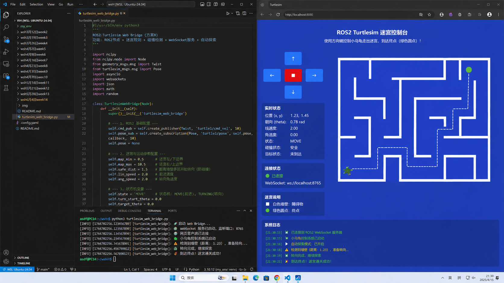

# 📝 Week 14 ROS2 Turtlesim Web迷宫控制系统实验

姓名：王昕昊（Wang Xinhao）
学校：Shinhan University 国际学院 软件工程专业
课程名称：AI Robotics & Vision System
实验日期：2026年6月17日

---

# 🇨🇳 实验内容概述（Experiment Overview）

本周实验重点围绕 ROS2、Turtlesim、WebSocket 通信、网页控制界面以及迷宫导航系统展开。

实验基于 ROS2 Python 节点开发，通过发布 Twist 速度消息控制 Turtlesim 小乌龟运动，并结合 WebSocket 服务实现浏览器与 ROS2 节点之间的数据通信。

在网页端设计了可视化迷宫控制界面，用户可以通过方向按钮或键盘控制小乌龟移动，在迷宫中完成路径探索。同时系统能够实时显示当前位置、运动状态、连接状态以及运行日志，实现完整的人机交互控制流程。

整个实验过程同时涉及：

* Ubuntu WSL 开发环境
* VS Code 远程开发
* ROS2 Python Node
* Turtlesim 仿真环境
* WebSocket 网络通信
* HTML + CSS + JavaScript 网页控制
* 浏览器实时状态显示
* 小乌龟迷宫导航实验

---

# 1. Ubuntu + VS Code 开发环境准备

## 实验过程

首先启动 Windows 中的 Ubuntu 24.04 WSL 环境，并使用 VS Code Remote WSL 打开本周实验目录。

创建 Week14 项目文件夹后，完成 ROS2 Python 文件开发，并建立网页前端资源目录。

实验过程中完成：

```bash
mkdir week14
```

随后创建实验程序：

```text
turtlesim_web_bridge.py
index.html
style.css
script.js
```

整个开发过程均在 Ubuntu WSL 环境中完成。

---

## 实验结果

* Ubuntu WSL 正常运行
* VS Code 成功连接 Linux
* Week14 工程目录创建完成
* Python 开发环境正常
* 网页前端资源创建完成

---

# 2. ROS2 Turtlesim Web Bridge 节点开发

## 实验过程

本实验采用 Python 编写 ROS2 节点：

```bash
python3 turtlesim_web_bridge.py
```

程序首先创建 ROS2 Publisher：

```python
self.cmd_pub = self.create_publisher(
    Twist,
    "turtle1/cmd_vel",
    10
)
```

随后订阅小乌龟实时位姿：

```python
self.pose_sub = self.create_subscription(
    Pose,
    "turtle1/pose",
    self.pose_callback,
    10
)
```

程序持续接收：

* x
* y
* theta

实时更新乌龟状态。

---

## 实验结果

* ROS2 节点启动成功
* Publisher 创建成功
* Subscriber 正常工作
* Pose 数据实时更新
* 小乌龟能够接收速度控制

---

# 3. WebSocket 网页通信实验

## 实验过程

为了实现网页控制 ROS2，本实验搭建 WebSocket 服务。

程序监听：

```text
ws://localhost:8765
```

网页建立连接后：

```text
Connected
```

浏览器发送控制命令：

```json
{
    "move":"forward"
}
```

Python 后端实时解析：

```python
json.loads(message)
```

随后控制 ROS2 发布运动指令。

整个通信采用异步 asyncio + websockets 实现。

---

## 实验结果

* WebSocket 服务启动成功
* 浏览器连接正常
* 前后端通信正常
* 控制指令实时传输
* ROS2 节点能够接收网页命令

---

# 4. Turtlesim 迷宫控制网页设计

## 实验过程

为了实现更加直观的人机交互，本实验设计了 Web 控制页面。

网页主要包括：

* 方向控制按钮
* 停止按钮
* 实时状态信息
* WebSocket连接状态
* 迷宫地图
* 系统运行日志

用户可以通过：

* ↑ 前进
* ↓ 后退
* ← 左转
* → 右转

控制小乌龟在迷宫中移动。

同时网页实时显示：

```text
位置 (x,y)

方向(theta)

线速度

角速度

MOVE

安全状态
```

浏览器与 ROS2 实现实时同步。

---

## 实验结果

* 网页正常加载
* 控制按钮正常工作
* 键盘控制正常
* 浏览器实时刷新状态
* 小乌龟能够完成迷宫运动

---

# 5. 小乌龟迷宫导航实验

## 实验过程

本实验设计了二维迷宫环境。

程序设置：

```python
map_min = 0.5
map_max = 10.5
safe_dist = 1.5
```

实时检测：

```python
dist_left

dist_right

dist_top

dist_bottom
```

若检测到距离墙壁过近：

```text
⚠️ 检测到墙壁
```

系统自动进入：

```text
TURNING
```

状态。

程序随机选择：

```text
左转90°

或

右转90°
```

完成避障后重新进入：

```text
MOVE
```

继续探索迷宫。

---

## 实验结果

* 小乌龟能够正常运动
* 成功检测墙壁
* 自动完成避障
* 状态机正常切换
* 小乌龟能够持续探索迷宫

---

# 6. 实验中遇到的问题与解决

## WebSocket 与 ROS2 同时运行问题

由于 ROS2 Spin 与 asyncio 都需要占用主线程，因此程序初始无法同时运行。

解决方法：

使用 Python Thread：

```python
threading.Thread(
    target=rclpy.spin,
    daemon=True
)
```

让 ROS2 在后台运行。

主线程继续运行：

```python
asyncio.get_event_loop()
```

最终实现：

* ROS2
* WebSocket
* 浏览器

三者同时运行。

---

# 🇺🇸 English Summary

## Development Environment

The Week14 project was developed under Ubuntu WSL using Visual Studio Code.
A ROS2 Python node and a web interface were created successfully.

## ROS2 Communication

A ROS2 publisher and subscriber were implemented to control the turtlesim robot and receive its real-time pose information.

## WebSocket Service

A WebSocket server was deployed to establish communication between the browser and the ROS2 backend.

## Maze Web Interface

A browser-based control panel was developed with directional buttons, keyboard support, real-time status monitoring, connection status, and system logs.

## Maze Navigation

The turtle successfully navigated inside the maze.
Collision detection and automatic obstacle avoidance were implemented using a finite state machine.

## Experiment Outcome

The experiment successfully verified:

* ROS2 Node communication
* Turtlesim motion control
* WebSocket networking
* Browser remote control
* Maze navigation
* Automatic collision avoidance
* Real-time robot monitoring

---

# 🇰🇷 한국어 요약

## 개발 환경

Ubuntu WSL과 VS Code를 이용하여 ROS2 Turtlesim Web 제어 시스템을 구축하였다.

## ROS2 노드

Publisher와 Subscriber를 구현하여 거북이의 이동 제어 및 위치 정보를 실시간으로 처리하였다.

## WebSocket 통신

WebSocket 서버를 구축하여 웹 브라우저와 ROS2 노드 간의 실시간 통신을 구현하였다.

## 웹 제어 인터페이스

방향 버튼, 키보드 제어, 실시간 상태 정보, 연결 상태 및 시스템 로그를 포함한 웹 인터페이스를 구현하였다.

## 미로 탐색

거북이는 미로 안에서 정상적으로 이동하였으며, 충돌 감지와 자동 회피 기능이 정상적으로 동작하였다.

## 최종 결과

본 실험을 통해 다음 기능들을 성공적으로 검증하였다.

* ROS2 노드 통신
* Turtlesim 제어
* WebSocket 기반 원격 제어
* 브라우저 실시간 제어
* 미로 탐색
* 자동 충돌 회피
* 실시간 상태 모니터링

---


